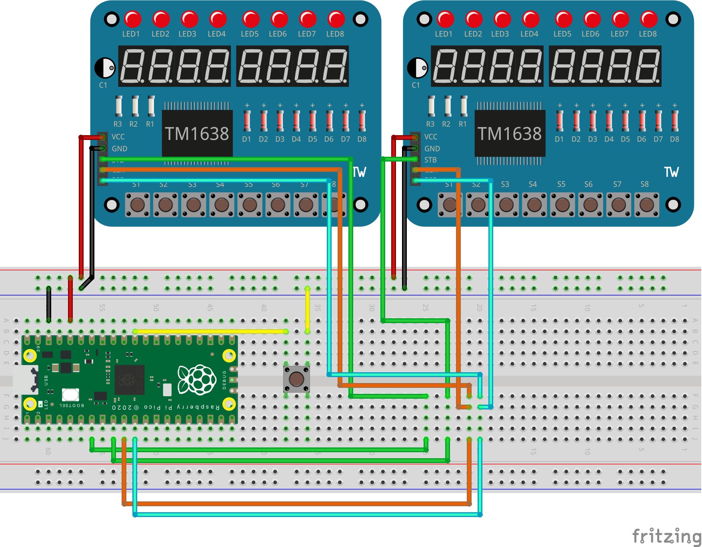

# MicroPython - Mancala Game - 2xTM1638/Pico

Python code to implement a Mancala game using two TM1638 and a Raspberry Pico.

## Game Rules

Best to watch the following video
https://www.youtube.com/watch?v=OX7rj93m6o8

## Wiring diagram

## Installation

Copy the following files on the Pico

 - main.py
 - mancala.py
 - TM1638Driver.py
 - sevenSegFont.py

